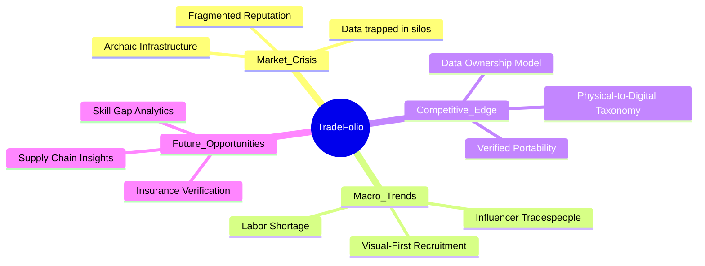
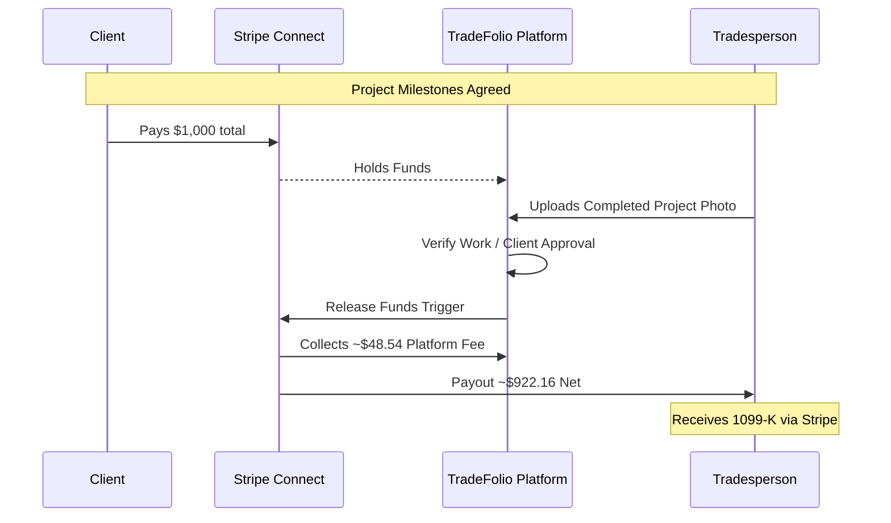

# Business Strategy

## Strategic Overview

## 1. The Digital Identity Crisis in Skilled Trades

LinkedIn and ERP tools ignore tradespeople's individual career growth. Current market solutions fail to address the individual tradesperson's need for a portable professional identity:

- **Enterprise Tools** (Procore, ServiceTitan): Designed for companies, not individuals
- **Gig Platforms** (TaskRabbit, Angi): Commoditize skilled labor into price-driven bids

TradeFolio solves for fragmented, non-portable reputations—empowering the worker to own their career data.

## 2. Macro Trends Driving Adoption

Three converging trends create perfect timing for this solution:

### 2.1 Labor Shortage & Leverage Shift
- Skilled trades face severe labor shortages
- Leverage has shifted to workers who can now demand higher wages
- A verified digital portfolio allows high-performers to demonstrate value instantly

### 2.2 The "Influencer" Tradesperson
- Gen Z and Millennials already document their work on social media
- Hashtags like #weldernation generate millions of impressions
- These platforms lack professional taxonomy—TradeFolio structures this into hireable assets

### 2.3 Visual-First Recruitment
- Recruiters struggle to assess competency via text resumes
- The market demands "proof of work" recruitment
- Portfolio of verified project images serves as primary vetting mechanism

## 3. Competitive Landscape Analysis

| Type | Players | Strengths | Weakness vs. TradeFolio |
|------|---------|-----------|-------------------------|
| Gig Marketplace | TaskRabbit, Angi, Thumbtack | Scale, payment rails | No history or identity control; high lead fees |
| Construction Software | Procore, Jobber | Firm operations | Data is not worker-owned |
| Social Networks | LinkedIn, Facebook | Network effects | Resume bias; no visual proof |
| Niche Trade Apps | Hammr, SkillCat | Trade focus | Fragmented; weak portfolios |

### Strategic Differentiator

**Data Ownership Model**: Unlike Procore (company-owned) or Angi (transaction-owned), TradeFolio makes the worker the owner of the data. This portability ensures long-term retention as the user's profile value compounds over time.

## 4. The "System of Record" Opportunity

The ultimate vision is for TradeFolio to become the **API for the Skilled Workforce**. By structuring unstructured data—turning a photo of a fuse box into a tagged data point—the platform builds a unique dataset with value beyond recruitment:

- **Insurance**: Verifying quality of work for liability policies
- **Education**: Identifying skill gaps across regions
- **Supply Chain**: Understanding tools and materials used on job sites

## 5. Revenue Model

### 5.1 B2C Subscription: TradeFolio Pro

**Price Point**: $9 - $19/month

| Feature | Free | Pro |
|---------|------|-----|
| Media Storage | 500MB | 50GB |
| "Verified Pro" Badge | No | Yes |
| Search Prominence | Standard | Featured |
| Profile Analytics | Basic | Detailed |
| YouTube Auto-Sync | No | Yes |

### 5.2 B2B Recruitment: Talent Access License

**Price Point**: $299 - $999/month per seat

- **Granular Filtering**: Search by specific technical skills (e.g., "TIG welder with OSHA-30")
- **Verified Outreach**: Direct messaging to passive candidates
- **Video Job Postings**: Attract talent with visual job descriptions

### 5.3 Transactional Revenue: The "Gig" Layer

**Fee Structure**: 3-5% platform fee on transactions

- Functions as "Business-in-a-Box" for solopreneurs
- Handles invoicing, payments, and escrow
- Fee justified by "Trust Layer"—funds held until job verified complete

### 5.4 Verification Services

**One-Time Fee**: $49

- "Master-Verified" badge after manual review
- Identity and credential verification
- Premium trust signal for winning bids

## 6. Payment Flow Architecture

**Fee Mechanics** (Corrected calculation for $1,000 job):
1. Client pays $1,000 total
2. Stripe deducts processing (~$29.30)
3. Platform takes 5% service fee of remaining (~$48.54)
4. Contractor receives ~$922.16

---

*See [Proposal Review](./proposal-review.md) for detailed corrections and recommendations.*
