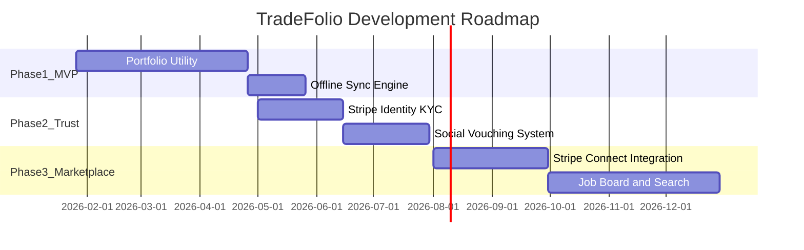

# Roadmap & Budget

## Development Roadmap

## Phase 1: The "Cold Start" MVP (Months 0-4)

### Focus
Portfolio utility only. No payments. No jobs. Just the best way to catalog work.

### Features
- Project-based portfolio creation
- Before/After slider component
- Skill taxonomy tagging
- Basic profile pages
- Photo/video uploads with compression
- YouTube OAuth sync

### Technical Goals
- Stable offline sync
- Fast video uploads (< 30 seconds for 1-minute video)
- Sub-2-second app load time

### Milestone
**1,000 Weekly Active Users (WAU)** creating content

### Success Criteria
- Users complete profile setup in < 5 minutes
- Average 3+ projects per active user
- 4.5+ star app store rating

## Phase 2: The Trust Layer (Months 5-8)

### Focus
Verification and Networking

### Features
- Stripe Identity integration (KYC)
- Credential upload and validation
- "Vouch" system for peer endorsements
- Social feed with algorithmic sorting
- "Crew" tagging for collaborations
- Geospatial search

### Technical Goals
- < 48 hour identity verification turnaround
- 99.9% uptime for verification services
- Real-time sync across devices

### Milestone
- Launch "Pro" subscription tier
- **Target 5% conversion rate** from free to paid
- 500 verified "Pro" users

### Success Criteria
- 80%+ KYC completion rate
- Average 2+ endorsements per verified user
- < 1% fraudulent account rate

## Phase 3: The Marketplace (Months 9-12)

### Focus
Revenue generation

### Features
- Job Board for recruiters
- Estimate Builder
- Invoicing system
- Stripe Connect payments
- Milestone-based escrow
- Direct messaging

### Technical Goals
- PCI DSS compliance
- < 3 second payment processing
- 99.99% transaction success rate

### Milestone
**$50,000 Monthly Gross Merchandise Value (GMV)** flowing through the platform

### Success Criteria
- 100+ paying recruiter accounts
- $500+ average transaction value
- < 2% dispute rate

## Budget Breakdown

### Original Estimate

| Category | Amount |
|----------|--------|
| Development | $100,000 - $150,000 |
| Infrastructure (Year 1) | $12,000 |
| Marketing | $25,000 |
| Legal/Compliance | $5,000 |
| **Total** | **$150,000 - $200,000** |

### Revised Realistic Estimate

Based on proposal review feedback, a more realistic budget:

| Category | Conservative | Realistic |
|----------|--------------|-----------|
| Development (Agency/Freelance) | $150,000 | $250,000 |
| Infrastructure (Year 1) | $15,000 | $25,000 |
| Marketing & User Acquisition | $50,000 | $100,000 |
| Legal/Compliance | $10,000 | $20,000 |
| Contingency (20%) | $45,000 | $79,000 |
| **Total** | **$270,000** | **$474,000** |

### Infrastructure Cost Details

| Service | Monthly Cost | Annual |
|---------|--------------|--------|
| AWS (RDS, S3, CloudFront) | $500-1,500 | $6,000-18,000 |
| Video Processing (Mux → MediaConvert) | $200-800 | $2,400-9,600 |
| Search (Algolia/Typesense) | $100-300 | $1,200-3,600 |
| Monitoring & Analytics | $100-200 | $1,200-2,400 |
| Stripe Fees | Variable | ~2.9% + $0.30/transaction |

### Development Team Options

**Option A: Outsourced Agency**
- Cost: $100-150/hour
- Timeline: 6-9 months for MVP
- Pros: Faster start, less management
- Cons: Higher cost, less control

**Option B: Freelance Engineers (2-3)**
- Cost: $75-125/hour
- Timeline: 4-6 months for MVP
- Pros: More control, lower cost
- Cons: Management overhead, coordination

**Option C: In-House Team**
- Cost: $150-250k/year salary + benefits
- Timeline: Ongoing
- Pros: Full control, IP ownership
- Cons: Highest upfront cost, hiring time

## Risk Mitigation

### Technical Risks

| Risk | Mitigation |
|------|------------|
| Offline sync complexity | Start with WatermelonDB proven patterns |
| Video cost overruns | Monitor closely, migrate from Mux to AWS at 10k users |
| Credential verification | Manual review first, automate incrementally |

### Business Risks

| Risk | Mitigation |
|------|------------|
| Low user adoption | Focus on trade school partnerships for early traction |
| Competitor response | Move fast, build switching costs via data ownership |
| Regulatory changes | Legal review quarterly, maintain compliance documentation |

## Key Performance Indicators (KPIs)

### Growth Metrics
- Weekly Active Users (WAU)
- Monthly Active Users (MAU)
- Projects created per user
- User retention (30/60/90 day)

### Revenue Metrics
- Monthly Recurring Revenue (MRR)
- Pro conversion rate
- Customer Acquisition Cost (CAC)
- Lifetime Value (LTV)
- LTV:CAC ratio (target: 3:1+)

### Product Metrics
- Time to first project
- Profile completion rate
- Search-to-hire conversion
- NPS score

---

*See [Proposal Review](./proposal-review.md) for detailed analysis and recommendations.*
