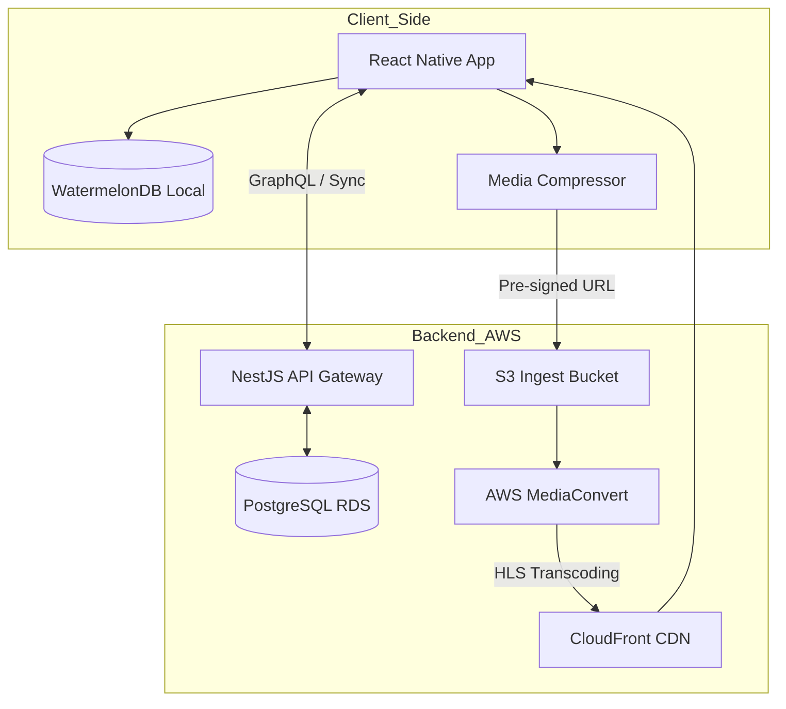
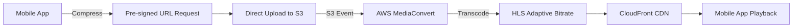
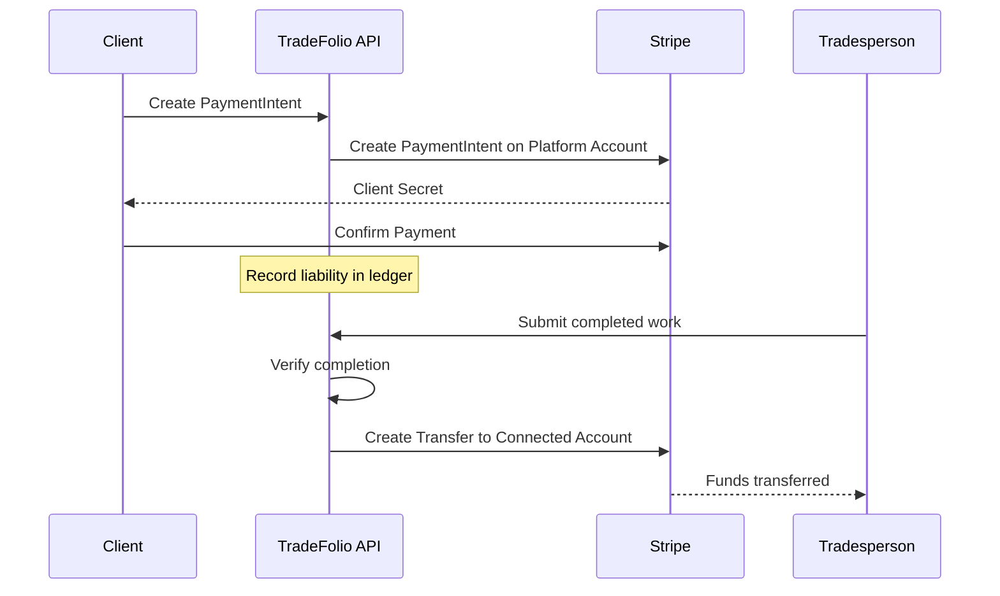
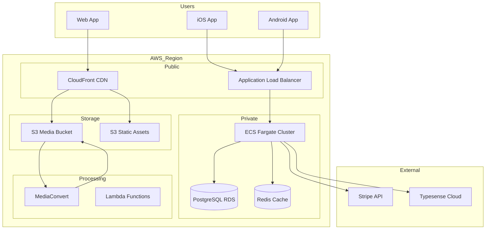

# Technical Architecture Overview

## System Architecture



## Technology Stack Summary

| Layer | Technology | Justification |
|-------|------------|---------------|
| **Mobile** | React Native (TypeScript) + Expo | Cross-platform efficiency, near-native performance |
| **Local Data** | WatermelonDB (SQLite) | Offline-first with robust sync |
| **Backend** | Node.js (NestJS) | Opinionated architecture, TypeScript support |
| **Database** | PostgreSQL (AWS RDS) | Relational data for complex user/project relationships |
| **Search** | Typesense or Algolia | Fuzzy matching for skills (e.g., "tig" → "GTAW") |
| **API** | GraphQL | Fetch exactly what's needed, reduce data usage |
| **Video** | Mux (MVP) → AWS MediaConvert (scale) | Ease of use vs. cost optimization |
| **CDN** | AWS CloudFront | Low latency media delivery |
| **Payments** | Stripe Connect Express | Split payments, escrow, 1099-K handling |
| **Identity** | Stripe Identity | KYC verification with PII delegation |

## 1. Mobile Frontend

### Technology Selection: React Native with Expo

**Justification:**

- **Cross-Platform Efficiency**: Single engineering team deploys to iOS and Android, reducing costs by ~40% vs. native development
- **Performance**: New Architecture (Fabric renderer, TurboModules) provides near-native performance
- **Talent Pool**: JavaScript/TypeScript developers are abundant and easier to hire

### Key Libraries

| Library | Purpose |
|---------|---------|
| `@shopify/flash-list` | High-performance lists for photo/video feeds (better view recycling than FlatList) |
| `react-native-compressor` | Client-side image/video compression before upload |
| `expo-av` | Video playback |
| `react-native-maps` | Project location visualization |
| `expo-file-system` | Local file management for offline assets |
| `react-native-blob-util` | Background file downloads |

### Mobile Architecture Patterns

```
src/
├── components/        # Reusable UI components
├── screens/           # Screen-level components
├── navigation/        # React Navigation setup
├── services/          # API calls, auth, sync
├── database/          # WatermelonDB models and migrations
├── hooks/             # Custom React hooks
├── utils/             # Helper functions
└── types/             # TypeScript definitions
```

## 2. Offline-First Data Layer

### Challenge
Users in basements, rural areas, or underground must use the app without frustration.

### Solution: WatermelonDB

WatermelonDB is built on SQLite and optimized for React Native with lazy loading and observable queries.

**Architecture:**
- App maintains full local copy of user's relevant data
- Sync Engine runs in background
- Tracks log of changes (Creates, Updates, Deletes) locally
- Pushes changes when network available

### Sync Mechanism

1. **Timestamp Tracking**: App sends `last_pulled_at` timestamp
2. **Delta Fetching**: Backend returns only records modified after that timestamp
3. **Local ID Mapping**: `id` (server) and `_id` (local) mapping for offline-created records

### Critical: Binary Asset Storage

**Problem**: Storing binary assets directly in WatermelonDB causes performance degradation and sync instability.

**Solution**: Reference-pointer architecture

```typescript
// WatermelonDB Schema
const projectMediaSchema = {
  name: 'project_media',
  columns: [
    { name: 'remote_url', type: 'string' },      // Cloud storage URL
    { name: 'local_path', type: 'string', isOptional: true }, // Device path
    { name: 'blur_hash', type: 'string' },       // Instant placeholder
    { name: 'sync_status', type: 'string' },     // pending, synced, error
  ]
}
```

**Flow:**
1. Store only references in database
2. Background worker downloads assets to device filesystem
3. UI loads from `local_path` if available, else `remote_url` or `blur_hash`

See [Offline Sync](./offline-sync.md) for detailed conflict resolution.

## 3. Backend Infrastructure

### Framework: NestJS on AWS

**Justification:**
- Opinionated, Angular-style architecture
- Enforces code quality and scalability
- TypeScript native
- Excellent for growing from MVP to enterprise

### Backend Structure

```
src/
├── modules/
│   ├── auth/          # Authentication, JWT
│   ├── users/         # User management
│   ├── profiles/      # Trade profiles
│   ├── projects/      # Portfolio projects
│   ├── media/         # Upload handling
│   ├── verification/  # KYC, credentials
│   ├── payments/      # Stripe integration
│   └── search/        # Typesense integration
├── common/            # Shared utilities, guards
├── database/          # TypeORM entities, migrations
└── config/            # Environment configuration
```

### Database: PostgreSQL (AWS RDS)

**Why PostgreSQL:**
- Relational data required for complex relationships (users, projects, skills, endorsements)
- PostGIS extension for geospatial queries
- JSON columns for flexible metadata
- Mature, battle-tested

### Search: Typesense or Algolia

**Why dedicated search:**
- PostgreSQL full-text search insufficient for "fuzzy" skill matching
- Need: searching "tig" matches "GTAW", "TIG Welding", etc.
- Faceted filtering by location, experience, certifications

### API Layer: GraphQL

**Why GraphQL over REST:**
- Mobile app fetches exactly needed data
- Single request: "Get user profile + top 3 projects + verified badges"
- Reduces data usage for users on limited data plans
- Strong typing with code generation

See [GraphQL API](./graphql-api.md) for schema details.

## 4. Media Pipeline

Video hosting is the single biggest technical risk for cost blowouts.

### Pipeline Design



### Processing Steps

1. **Upload**: Mobile requests pre-signed URL, uploads compressed video to S3 Ingest Bucket
2. **Trigger**: S3 event triggers MediaConvert job
3. **Transcode**: Convert to HLS format with adaptive bitrates (360p, 720p, 1080p)
4. **Optimize**: Generate WebP animated thumbnail for feed preview
5. **Deliver**: Serve via CloudFront CDN for low latency globally

### Cost Strategy

| Phase | Service | Cost | Notes |
|-------|---------|------|-------|
| MVP | Mux | ~$0.05/min | Easiest to implement |
| Scale (10k+ users) | AWS MediaConvert | ~$0.003/min | Migrate to preserve margins |

**Recommendation**: Start with Mux for speed, migrate at 10,000 users.

### Cost Monitoring

```bash
# Set AWS Budget alarm
aws budgets create-budget \
  --account-id $ACCOUNT_ID \
  --budget file://media-budget.json
```

Alert when MediaConvert costs exceed $500/month threshold.

## 5. Payment Infrastructure

### Stripe Connect Express

**Why Express over Standard or Custom:**
- Stripe handles complex onboarding UI (bank details, SSN/EIN)
- Platform controls fund flow (essential for escrow)
- Stripe generates 1099-K tax forms
- Reduces development time and liability

### Integration Architecture



### Escrow Implementation

**Note**: Stripe doesn't support true escrow. Use "separate charges and transfers":

1. On payment: Create PaymentIntent on platform account
2. Record liability in internal ledger
3. On milestone completion: Trigger transfer to seller's connected account
4. Configure payout schedule to manual with delay (T+7 days)

See [Security & Compliance](./security-compliance.md) for KYC integration.

## 6. Infrastructure Diagram



## 7. Development Environment

### Required Tools

- Node.js 18+
- PostgreSQL 14+
- Redis (for caching, queues)
- React Native CLI + Expo
- AWS CLI configured

### Local Development

```bash
# Clone and install
git clone https://github.com/tradefolio/app.git
cd app
npm install

# Start backend
cd backend
docker-compose up -d  # PostgreSQL, Redis
npm run start:dev

# Start mobile
cd ../mobile
npx expo start
```

---

*See related documentation:*
- [Database Schema](./database-schema.md)
- [GraphQL API](./graphql-api.md)
- [Offline Sync](./offline-sync.md)
- [Security & Compliance](./security-compliance.md)
