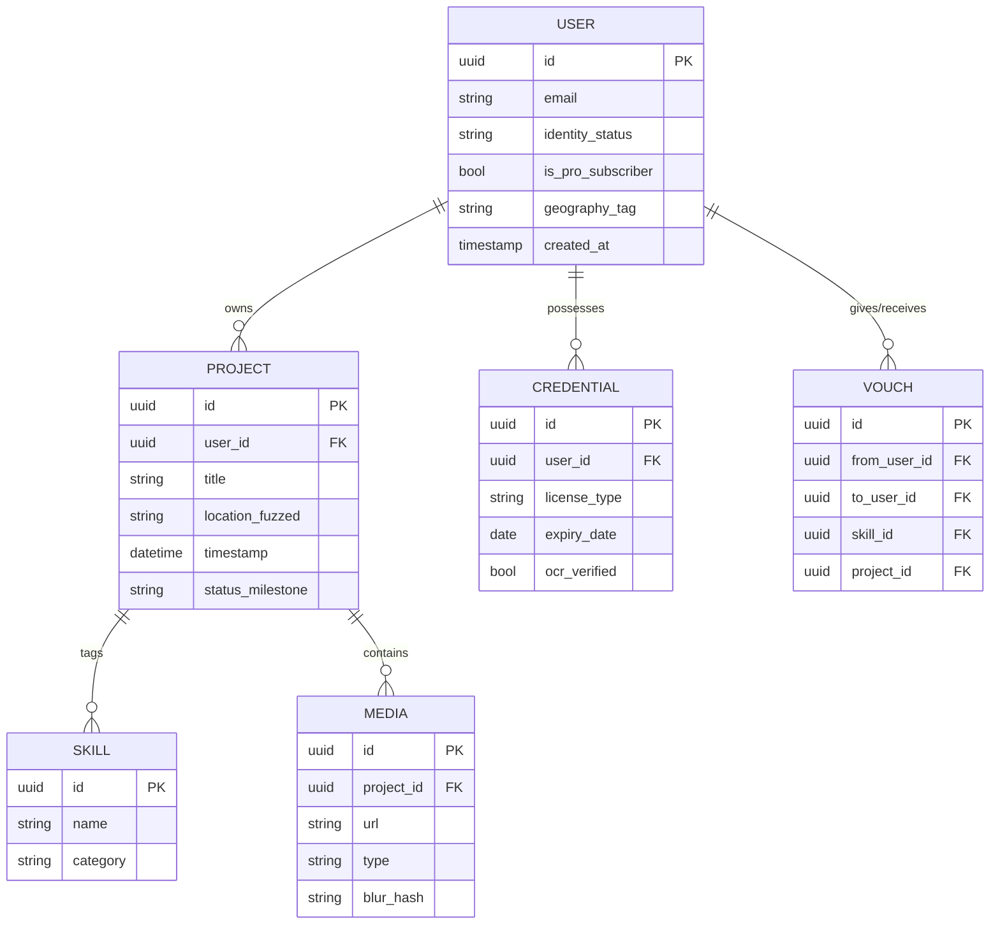

# Database Schema

## Entity Relationship Diagram



## PostgreSQL Schema

### Profiles Table

```sql
-- User profiles with trade information
CREATE TABLE profiles (
    profile_id UUID PRIMARY KEY DEFAULT gen_random_uuid(),
    user_id UUID UNIQUE NOT NULL,
    
    -- Basic Info
    full_name VARCHAR(100) NOT NULL,
    email VARCHAR(255) UNIQUE NOT NULL,
    phone VARCHAR(20),
    avatar_url TEXT,
    
    -- Trade Info
    trade_category VARCHAR(50),
    specialty VARCHAR(100),
    years_experience INTEGER DEFAULT 0,
    hourly_rate DECIMAL(10, 2),
    
    -- Location
    location_city VARCHAR(100),
    location_state VARCHAR(50),
    location_zip VARCHAR(10),
    location_coords GEOGRAPHY(POINT, 4326),  -- PostGIS
    location_privacy VARCHAR(20) DEFAULT 'city',  -- 'exact', 'city', 'state'
    
    -- Verification
    identity_verified BOOLEAN DEFAULT FALSE,
    identity_verified_at TIMESTAMP,
    stripe_identity_id VARCHAR(100),
    
    -- Subscription
    subscription_tier VARCHAR(20) DEFAULT 'free',  -- 'free', 'plus', 'pro'
    subscription_status VARCHAR(20) DEFAULT 'inactive',
    stripe_customer_id VARCHAR(100),
    
    -- YouTube Integration
    youtube_channel_id VARCHAR(50),
    youtube_channel_linked BOOLEAN DEFAULT FALSE,
    youtube_linked_at TIMESTAMP,
    
    -- Metadata
    profile_completion INTEGER DEFAULT 0,  -- Percentage
    created_at TIMESTAMP DEFAULT CURRENT_TIMESTAMP,
    updated_at TIMESTAMP DEFAULT CURRENT_TIMESTAMP,
    last_active_at TIMESTAMP,
    
    -- Constraints
    CONSTRAINT valid_location_privacy CHECK (location_privacy IN ('exact', 'city', 'state')),
    CONSTRAINT valid_subscription_tier CHECK (subscription_tier IN ('free', 'plus', 'pro'))
);

-- Indexes for common queries
CREATE INDEX idx_profiles_trade ON profiles(trade_category);
CREATE INDEX idx_profiles_location ON profiles USING GIST(location_coords);
CREATE INDEX idx_profiles_subscription ON profiles(subscription_tier);
```

### Projects Table

```sql
-- Portfolio projects (handles Native & YouTube sources)
CREATE TABLE projects (
    project_id UUID PRIMARY KEY DEFAULT gen_random_uuid(),
    profile_id UUID NOT NULL REFERENCES profiles(profile_id) ON DELETE CASCADE,
    
    -- Basic Info
    title VARCHAR(100) NOT NULL,
    description TEXT,
    
    -- Source
    source_type VARCHAR(10) NOT NULL,
    CONSTRAINT valid_source CHECK (source_type IN ('native', 'youtube')),
    
    -- Media (for YouTube source)
    video_url TEXT,
    thumbnail_url TEXT,
    duration_seconds INTEGER,
    
    -- Location
    location_address VARCHAR(255),
    location_city VARCHAR(100),
    location_state VARCHAR(50),
    location_coords GEOGRAPHY(POINT, 4326),
    location_fuzzed GEOGRAPHY(POINT, 4326),  -- Privacy-protected version
    
    -- Status
    status VARCHAR(20) DEFAULT 'draft',
    CONSTRAINT valid_status CHECK (status IN ('draft', 'published', 'archived')),
    
    -- Verification
    is_verified BOOLEAN DEFAULT FALSE,
    verified_at TIMESTAMP,
    verified_by UUID REFERENCES profiles(profile_id),
    
    -- Engagement
    view_count INTEGER DEFAULT 0,
    like_count INTEGER DEFAULT 0,
    
    -- Timestamps
    project_date DATE,  -- When the work was done
    created_at TIMESTAMP DEFAULT CURRENT_TIMESTAMP,
    updated_at TIMESTAMP DEFAULT CURRENT_TIMESTAMP,
    published_at TIMESTAMP
);

-- Indexes
CREATE INDEX idx_projects_profile ON projects(profile_id);
CREATE INDEX idx_projects_status ON projects(status);
CREATE INDEX idx_projects_location ON projects USING GIST(location_fuzzed);
CREATE INDEX idx_projects_created ON projects(created_at DESC);
```

### Project Media Table

```sql
-- Media files for projects (photos, videos)
CREATE TABLE project_media (
    media_id UUID PRIMARY KEY DEFAULT gen_random_uuid(),
    project_id UUID NOT NULL REFERENCES projects(project_id) ON DELETE CASCADE,
    
    -- Media Info
    media_type VARCHAR(10) NOT NULL,
    CONSTRAINT valid_media_type CHECK (media_type IN ('image', 'video')),
    
    -- URLs
    original_url TEXT NOT NULL,          -- S3 URL for original
    processed_url TEXT,                   -- CloudFront URL for optimized
    thumbnail_url TEXT,
    
    -- Video-specific
    duration_seconds INTEGER,
    hls_playlist_url TEXT,               -- For adaptive streaming
    
    -- Before/After
    is_before_after BOOLEAN DEFAULT FALSE,
    before_after_type VARCHAR(10),       -- 'before' or 'after'
    before_after_pair_id UUID,           -- Links before/after pairs
    
    -- Metadata
    file_size_bytes BIGINT,
    width INTEGER,
    height INTEGER,
    mime_type VARCHAR(50),
    blur_hash VARCHAR(100),              -- BlurHash for placeholders
    exif_data JSONB,                     -- GPS, timestamp from photo
    
    -- Processing
    processing_status VARCHAR(20) DEFAULT 'pending',
    CONSTRAINT valid_processing CHECK (processing_status IN ('pending', 'processing', 'complete', 'failed')),
    
    -- Order
    display_order INTEGER DEFAULT 0,
    
    -- Timestamps
    created_at TIMESTAMP DEFAULT CURRENT_TIMESTAMP,
    processed_at TIMESTAMP
);

-- Indexes
CREATE INDEX idx_media_project ON project_media(project_id);
CREATE INDEX idx_media_processing ON project_media(processing_status);
```

### Skills & Taxonomy Tables

```sql
-- Trade categories
CREATE TABLE trade_categories (
    category_id UUID PRIMARY KEY DEFAULT gen_random_uuid(),
    name VARCHAR(50) UNIQUE NOT NULL,
    slug VARCHAR(50) UNIQUE NOT NULL,
    icon_url TEXT,
    display_order INTEGER DEFAULT 0
);

-- Skills within trades
CREATE TABLE skills (
    skill_id UUID PRIMARY KEY DEFAULT gen_random_uuid(),
    category_id UUID REFERENCES trade_categories(category_id),
    name VARCHAR(100) NOT NULL,
    slug VARCHAR(100) NOT NULL,
    description TEXT,
    
    -- Aliases for fuzzy search
    aliases TEXT[],  -- e.g., ['TIG', 'GTAW', 'Gas Tungsten Arc']
    
    UNIQUE(category_id, slug)
);

-- Project skill tags
CREATE TABLE project_skills (
    project_id UUID REFERENCES projects(project_id) ON DELETE CASCADE,
    skill_id UUID REFERENCES skills(skill_id) ON DELETE CASCADE,
    PRIMARY KEY (project_id, skill_id)
);

-- Profile skill tags (aggregated)
CREATE TABLE profile_skills (
    profile_id UUID REFERENCES profiles(profile_id) ON DELETE CASCADE,
    skill_id UUID REFERENCES skills(skill_id) ON DELETE CASCADE,
    years_experience INTEGER DEFAULT 0,
    project_count INTEGER DEFAULT 0,
    is_verified BOOLEAN DEFAULT FALSE,
    PRIMARY KEY (profile_id, skill_id)
);

-- Seed data for categories
INSERT INTO trade_categories (name, slug, display_order) VALUES
    ('Electrical', 'electrical', 1),
    ('HVAC', 'hvac', 2),
    ('Plumbing', 'plumbing', 3),
    ('Welding', 'welding', 4),
    ('Carpentry', 'carpentry', 5),
    ('Masonry', 'masonry', 6),
    ('Roofing', 'roofing', 7),
    ('Painting', 'painting', 8);

-- Seed data for electrical skills
INSERT INTO skills (category_id, name, slug, aliases) VALUES
    ((SELECT category_id FROM trade_categories WHERE slug = 'electrical'), 
     'Rough-in', 'rough-in', ARRAY['rough in', 'roughing']),
    ((SELECT category_id FROM trade_categories WHERE slug = 'electrical'), 
     'Conduit Bending', 'conduit-bending', ARRAY['pipe bending', 'emt bending']),
    ((SELECT category_id FROM trade_categories WHERE slug = 'electrical'), 
     'Panel Termination', 'panel-termination', ARRAY['panel work', 'breaker panel']),
    ((SELECT category_id FROM trade_categories WHERE slug = 'electrical'), 
     'Low Voltage', 'low-voltage', ARRAY['LV', 'data', 'network cabling']);
```

### Credentials Table

```sql
-- User credentials and certifications
CREATE TABLE credentials (
    credential_id UUID PRIMARY KEY DEFAULT gen_random_uuid(),
    profile_id UUID NOT NULL REFERENCES profiles(profile_id) ON DELETE CASCADE,
    
    -- Credential Info
    credential_type VARCHAR(50) NOT NULL,  -- 'license', 'certification', 'training'
    name VARCHAR(100) NOT NULL,
    issuing_authority VARCHAR(100),
    license_number VARCHAR(100),
    
    -- Validity
    issue_date DATE,
    expiry_date DATE,
    is_expired BOOLEAN GENERATED ALWAYS AS (expiry_date < CURRENT_DATE) STORED,
    
    -- Verification
    verification_status VARCHAR(20) DEFAULT 'pending',
    CONSTRAINT valid_verification CHECK (verification_status IN ('pending', 'verified', 'rejected', 'expired')),
    verified_at TIMESTAMP,
    verified_by UUID,
    rejection_reason TEXT,
    
    -- Document
    document_url TEXT,  -- Uploaded image of credential
    ocr_extracted_data JSONB,
    
    -- Timestamps
    created_at TIMESTAMP DEFAULT CURRENT_TIMESTAMP,
    updated_at TIMESTAMP DEFAULT CURRENT_TIMESTAMP
);

-- Indexes
CREATE INDEX idx_credentials_profile ON credentials(profile_id);
CREATE INDEX idx_credentials_type ON credentials(credential_type);
CREATE INDEX idx_credentials_expiry ON credentials(expiry_date) WHERE expiry_date IS NOT NULL;
```

### Vouches & Endorsements Table

```sql
-- Peer vouching system
CREATE TABLE vouches (
    vouch_id UUID PRIMARY KEY DEFAULT gen_random_uuid(),
    
    -- Participants
    from_profile_id UUID NOT NULL REFERENCES profiles(profile_id) ON DELETE CASCADE,
    to_profile_id UUID NOT NULL REFERENCES profiles(profile_id) ON DELETE CASCADE,
    
    -- What's being vouched
    skill_id UUID REFERENCES skills(skill_id),
    project_id UUID REFERENCES projects(project_id),  -- Co-worked project
    
    -- Validation
    is_validated BOOLEAN DEFAULT FALSE,  -- System verified co-work
    validation_method VARCHAR(50),  -- 'project_collab', 'employer_overlap', 'manual'
    
    -- Content
    comment TEXT,
    
    -- Timestamps
    created_at TIMESTAMP DEFAULT CURRENT_TIMESTAMP,
    
    -- Constraints
    CONSTRAINT no_self_vouch CHECK (from_profile_id != to_profile_id),
    UNIQUE(from_profile_id, to_profile_id, skill_id)
);

-- Project collaborators (for crew tagging)
CREATE TABLE project_collaborators (
    project_id UUID REFERENCES projects(project_id) ON DELETE CASCADE,
    profile_id UUID REFERENCES profiles(profile_id) ON DELETE CASCADE,
    role VARCHAR(50),  -- 'lead', 'helper', 'apprentice'
    confirmed BOOLEAN DEFAULT FALSE,  -- Collaborator confirmed participation
    confirmed_at TIMESTAMP,
    PRIMARY KEY (project_id, profile_id)
);
```

### Auth Tokens Table

```sql
-- OAuth tokens for external integrations (YouTube)
CREATE TABLE auth_tokens (
    token_id UUID PRIMARY KEY DEFAULT gen_random_uuid(),
    profile_id UUID NOT NULL REFERENCES profiles(profile_id) ON DELETE CASCADE,
    
    -- Provider
    provider VARCHAR(50) NOT NULL DEFAULT 'google_youtube',
    provider_user_id VARCHAR(100),
    
    -- Tokens (encrypted)
    access_token_encrypted TEXT NOT NULL,
    refresh_token_encrypted TEXT,
    
    -- Validity
    expires_at TIMESTAMP,
    
    -- Scopes
    scopes TEXT[],
    
    -- Timestamps
    created_at TIMESTAMP DEFAULT CURRENT_TIMESTAMP,
    updated_at TIMESTAMP DEFAULT CURRENT_TIMESTAMP,
    
    UNIQUE(profile_id, provider)
);
```

### Payments Tables

```sql
-- Payment transactions
CREATE TABLE transactions (
    transaction_id UUID PRIMARY KEY DEFAULT gen_random_uuid(),
    
    -- Parties
    client_profile_id UUID REFERENCES profiles(profile_id),
    contractor_profile_id UUID NOT NULL REFERENCES profiles(profile_id),
    
    -- Project
    project_id UUID REFERENCES projects(project_id),
    
    -- Amounts
    gross_amount DECIMAL(10, 2) NOT NULL,
    platform_fee DECIMAL(10, 2),
    stripe_fee DECIMAL(10, 2),
    net_amount DECIMAL(10, 2),
    currency VARCHAR(3) DEFAULT 'USD',
    
    -- Stripe
    stripe_payment_intent_id VARCHAR(100),
    stripe_transfer_id VARCHAR(100),
    
    -- Status
    status VARCHAR(20) DEFAULT 'pending',
    CONSTRAINT valid_tx_status CHECK (status IN ('pending', 'processing', 'completed', 'failed', 'refunded', 'disputed')),
    
    -- Timestamps
    created_at TIMESTAMP DEFAULT CURRENT_TIMESTAMP,
    completed_at TIMESTAMP,
    
    -- Metadata
    description TEXT,
    metadata JSONB
);

-- Milestone-based invoices
CREATE TABLE invoices (
    invoice_id UUID PRIMARY KEY DEFAULT gen_random_uuid(),
    contractor_profile_id UUID NOT NULL REFERENCES profiles(profile_id),
    client_email VARCHAR(255),
    
    -- Project
    project_id UUID REFERENCES projects(project_id),
    
    -- Line items stored as JSONB
    line_items JSONB NOT NULL,  -- [{description, quantity, rate, amount}]
    
    -- Totals
    subtotal DECIMAL(10, 2) NOT NULL,
    tax_rate DECIMAL(5, 4) DEFAULT 0,
    tax_amount DECIMAL(10, 2) DEFAULT 0,
    total DECIMAL(10, 2) NOT NULL,
    
    -- Status
    status VARCHAR(20) DEFAULT 'draft',
    CONSTRAINT valid_invoice_status CHECK (status IN ('draft', 'sent', 'viewed', 'paid', 'overdue', 'cancelled')),
    
    -- Dates
    invoice_date DATE DEFAULT CURRENT_DATE,
    due_date DATE,
    
    -- PDF
    pdf_url TEXT,
    
    -- Timestamps
    created_at TIMESTAMP DEFAULT CURRENT_TIMESTAMP,
    sent_at TIMESTAMP,
    paid_at TIMESTAMP
);
```

## Data Storage Strategy

| Data Type | Primary Storage | Sync Priority | Conflict Strategy |
|-----------|-----------------|---------------|-------------------|
| **User Identity/PII** | Stripe Vault / RDS | High | Server Wins |
| **Project Metadata** | PostgreSQL (RDS) | Medium | Server Wins |
| **Skills/Tags** | PostgreSQL (RDS) | Medium | Merge (Union) |
| **Media Files** | AWS S3 / CloudFront | Low (Async) | Client Uploads Only |

## Migrations

Use TypeORM or a similar migration tool to manage schema changes:

```bash
# Generate migration
npm run migration:generate -- -n AddProfileBio

# Run migrations
npm run migration:run

# Revert last migration
npm run migration:revert
```

---

*See [Offline Sync](./offline-sync.md) for sync conflict resolution details.*
