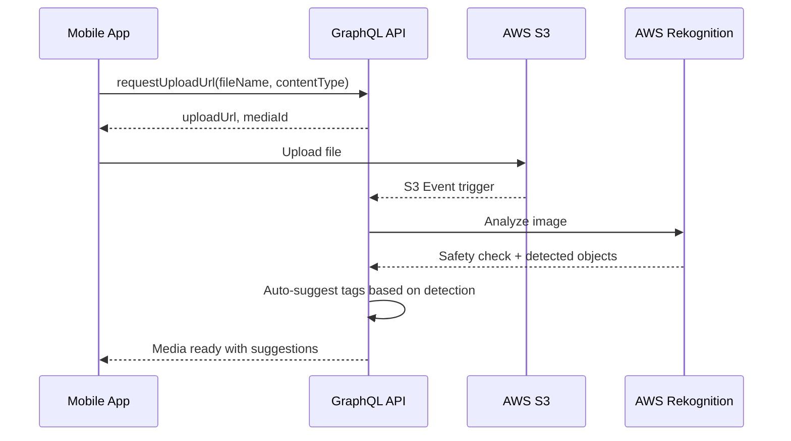

# GraphQL API Schema

## Overview

To build a "Smart Portfolio," the GraphQL schema handles deeply nested relationships (Users → Projects → Skills/Media) in a single, efficient request. This prevents the "n+1 query" problem that plagues mobile apps on slow job-site connections.

## Core Schema

### Enums

```graphql
# Skill Taxonomy for Structured Data
enum TradeCategory {
  ELECTRICAL
  HVAC
  PLUMBING
  WELDING
  CARPENTRY
  MASONRY
  ROOFING
  PAINTING
}

enum SubscriptionTier {
  FREE
  PLUS
  PRO
}

enum VerificationStatus {
  PENDING
  VERIFIED
  REJECTED
  EXPIRED
}

enum MediaType {
  IMAGE
  VIDEO
}

enum ProjectStatus {
  DRAFT
  PUBLISHED
  ARCHIVED
}

enum ProcessingStatus {
  PENDING
  PROCESSING
  COMPLETE
  FAILED
}
```

### Core Types

```graphql
type Skill {
  id: ID!
  name: String!
  slug: String!
  category: TradeCategory!
  description: String
  aliases: [String!]
  
  # Aggregated data (for profile context)
  projectCount: Int
  isVerified: Boolean
}

type Media {
  id: ID!
  url: String!
  type: MediaType!
  thumbnailUrl: String
  blurHash: String
  
  # Video-specific
  durationSeconds: Int
  hlsPlaylistUrl: String
  
  # Before/After
  isBeforeAfter: Boolean
  beforeAfterType: String
  
  # Metadata
  width: Int
  height: Int
  metadata: String  # JSON for EXIF data (GPS, Timestamp)
  processingStatus: ProcessingStatus!
}

type Credential {
  id: ID!
  credentialType: String!
  name: String!
  issuingAuthority: String
  licenseNumber: String
  issueDate: String
  expiryDate: String
  isExpired: Boolean!
  verificationStatus: VerificationStatus!
  documentUrl: String
}

type Vouch {
  id: ID!
  fromUser: User!
  skill: Skill
  project: Project
  comment: String
  isValidated: Boolean!
  createdAt: String!
}

type Location {
  city: String
  state: String
  zipCode: String
  # Fuzzed coordinates for privacy
  latitude: Float
  longitude: Float
}

type Project {
  id: ID!
  title: String!
  description: String
  location: Location
  status: ProjectStatus!
  
  # Media
  media: [Media!]!
  featuredImage: Media
  
  # Skills
  taggedSkills: [Skill!]!
  
  # Collaborators
  collaborators: [User!]!
  
  # Verification
  isVerified: Boolean!
  verifiedAt: String
  
  # Engagement
  viewCount: Int!
  likeCount: Int!
  
  # Timestamps
  projectDate: String
  createdAt: String!
  publishedAt: String
}

type User {
  id: ID!
  fullName: String!
  email: String!
  avatarUrl: String
  
  # Trade Info
  tradeCategory: TradeCategory
  specialty: String
  yearsExperience: Int
  hourlyRate: Float
  
  # Location
  location: Location
  
  # Verification
  isVerifiedPro: Boolean!
  identityVerifiedAt: String
  
  # Subscription
  subscriptionTier: SubscriptionTier!
  
  # Portfolio
  portfolio: [Project!]!
  projectCount: Int!
  
  # Skills (aggregated)
  skillsSummary: [Skill!]!
  
  # Credentials
  credentials: [Credential!]!
  
  # Endorsements
  vouchesReceived: [Vouch!]!
  vouchesGiven: [Vouch!]!
  
  # Engagement
  profileCompletionPercent: Int!
  
  # Timestamps
  createdAt: String!
  lastActiveAt: String
}
```

### Query Operations

```graphql
type Query {
  # User/Profile queries
  me: User
  getProfile(userId: ID!): User
  searchProfiles(input: SearchProfilesInput!): ProfileSearchResult!
  
  # Project queries
  getProject(projectId: ID!): Project
  getProjectsByUser(userId: ID!, limit: Int, offset: Int): [Project!]!
  searchProjects(input: SearchProjectsInput!): ProjectSearchResult!
  getFeed(limit: Int, offset: Int): [Project!]!
  
  # Skill/Taxonomy queries
  getTradeCategories: [TradeCategoryInfo!]!
  getSkillsByCategory(category: TradeCategory!): [Skill!]!
  searchSkills(query: String!): [Skill!]!
  
  # Discovery
  getFeaturedProfiles: [User!]!
  getNearbyProfiles(latitude: Float!, longitude: Float!, radiusMiles: Int!): [User!]!
}

# Input types for search
input SearchProfilesInput {
  query: String
  tradeCategory: TradeCategory
  skills: [ID!]
  location: LocationInput
  radiusMiles: Int
  minYearsExperience: Int
  isVerifiedOnly: Boolean
  limit: Int
  offset: Int
}

input SearchProjectsInput {
  query: String
  skills: [ID!]
  location: LocationInput
  radiusMiles: Int
  limit: Int
  offset: Int
}

input LocationInput {
  latitude: Float!
  longitude: Float!
}

# Result types with pagination
type ProfileSearchResult {
  profiles: [User!]!
  totalCount: Int!
  hasMore: Boolean!
}

type ProjectSearchResult {
  projects: [Project!]!
  totalCount: Int!
  hasMore: Boolean!
}

type TradeCategoryInfo {
  category: TradeCategory!
  name: String!
  iconUrl: String
  skillCount: Int!
}
```

### Mutation Operations

```graphql
type Mutation {
  # Auth
  register(input: RegisterInput!): AuthPayload!
  login(email: String!, password: String!): AuthPayload!
  refreshToken(refreshToken: String!): AuthPayload!
  
  # Profile
  updateProfile(input: UpdateProfileInput!): User!
  updateAvatar(file: Upload!): User!
  updateLocationPrivacy(privacy: LocationPrivacy!): User!
  
  # Projects
  createProject(input: CreateProjectInput!): Project!
  updateProject(projectId: ID!, input: UpdateProjectInput!): Project!
  deleteProject(projectId: ID!): Boolean!
  publishProject(projectId: ID!): Project!
  
  # Media
  requestUploadUrl(input: UploadUrlInput!): UploadUrlPayload!
  addMediaToProject(projectId: ID!, input: AddMediaInput!): Media!
  removeMedia(mediaId: ID!): Boolean!
  reorderMedia(projectId: ID!, mediaIds: [ID!]!): [Media!]!
  
  # Skills
  addSkillToProject(projectId: ID!, skillId: ID!): Project!
  removeSkillFromProject(projectId: ID!, skillId: ID!): Project!
  
  # Collaborators
  inviteCollaborator(projectId: ID!, email: String!): Boolean!
  confirmCollaboration(projectId: ID!): Project!
  
  # Credentials
  addCredential(input: AddCredentialInput!): Credential!
  updateCredential(credentialId: ID!, input: UpdateCredentialInput!): Credential!
  deleteCredential(credentialId: ID!): Boolean!
  
  # Vouching
  createVouch(input: CreateVouchInput!): Vouch!
  deleteVouch(vouchId: ID!): Boolean!
  
  # Verification
  initiateIdentityVerification: VerificationSession!
  
  # YouTube Integration
  linkYouTubeChannel(authCode: String!): YouTubeLinkPayload!
  importYouTubeVideo(videoId: String!, projectId: ID): Project!
  unlinkYouTubeChannel: Boolean!
  
  # Subscription
  createCheckoutSession(tier: SubscriptionTier!): CheckoutSession!
  cancelSubscription: User!
}

# Input types
input RegisterInput {
  email: String!
  password: String!
  fullName: String!
  tradeCategory: TradeCategory
}

input UpdateProfileInput {
  fullName: String
  tradeCategory: TradeCategory
  specialty: String
  yearsExperience: Int
  hourlyRate: Float
  location: LocationInput
}

input CreateProjectInput {
  title: String!
  description: String
  location: LocationInput
  projectDate: String
  skillIds: [ID!]
}

input UpdateProjectInput {
  title: String
  description: String
  location: LocationInput
  projectDate: String
}

input UploadUrlInput {
  fileName: String!
  contentType: String!
  projectId: ID
}

input AddMediaInput {
  url: String!
  type: MediaType!
  isBeforeAfter: Boolean
  beforeAfterType: String
  displayOrder: Int
}

input AddCredentialInput {
  credentialType: String!
  name: String!
  issuingAuthority: String
  licenseNumber: String
  issueDate: String
  expiryDate: String
  documentUrl: String
}

input UpdateCredentialInput {
  name: String
  expiryDate: String
  documentUrl: String
}

input CreateVouchInput {
  toUserId: ID!
  skillId: ID
  projectId: ID
  comment: String
}

enum LocationPrivacy {
  EXACT
  CITY
  STATE
}

# Payload types
type AuthPayload {
  accessToken: String!
  refreshToken: String!
  user: User!
}

type UploadUrlPayload {
  uploadUrl: String!
  mediaId: ID!
  expiresAt: String!
}

type VerificationSession {
  sessionUrl: String!
  sessionId: String!
}

type YouTubeLinkPayload {
  channelId: String!
  channelName: String!
  recentVideos: [YouTubeVideo!]!
}

type YouTubeVideo {
  videoId: String!
  title: String!
  description: String
  thumbnailUrl: String!
  duration: Int!
  publishedAt: String!
}

type CheckoutSession {
  sessionUrl: String!
  sessionId: String!
}
```

## The "Smart Fetch" Strategy

On a job site, every kilobyte matters. TradeFolio uses GraphQL Fragments to request only what's needed for each view.

### Feed View Query

```graphql
query GetFeed($limit: Int, $offset: Int) {
  getFeed(limit: $limit, offset: $offset) {
    id
    title
    featuredImage {
      thumbnailUrl
      blurHash
    }
    taggedSkills {
      id
      name
    }
    isVerified
    viewCount
    likeCount
    createdAt
  }
}
```

### Profile Detail Query

```graphql
query GetFullProfile($userId: ID!) {
  getProfile(userId: $userId) {
    id
    fullName
    avatarUrl
    tradeCategory
    specialty
    yearsExperience
    location {
      city
      state
    }
    isVerifiedPro
    subscriptionTier
    
    skillsSummary {
      id
      name
      category
      projectCount
      isVerified
    }
    
    credentials {
      id
      name
      credentialType
      verificationStatus
      expiryDate
      isExpired
    }
    
    portfolio {
      id
      title
      featuredImage {
        thumbnailUrl
      }
      taggedSkills {
        name
      }
      isVerified
      projectDate
    }
    
    vouchesReceived {
      id
      fromUser {
        id
        fullName
        avatarUrl
      }
      skill {
        name
      }
      comment
      isValidated
    }
    
    profileCompletionPercent
  }
}
```

### Project Detail Query

```graphql
query GetProjectDetail($projectId: ID!) {
  getProject(projectId: $projectId) {
    id
    title
    description
    location {
      city
      state
    }
    projectDate
    isVerified
    viewCount
    likeCount
    
    media {
      id
      url
      type
      thumbnailUrl
      durationSeconds
      hlsPlaylistUrl
      isBeforeAfter
      beforeAfterType
      width
      height
    }
    
    taggedSkills {
      id
      name
      category
    }
    
    collaborators {
      id
      fullName
      avatarUrl
      specialty
    }
    
    createdAt
    publishedAt
  }
}
```

## Data Integrity: AI Verification Layer

While not in the core schema, the backend includes a "Verification Check" during upload mutations.

### Upload Flow with AI



### AI Checks

1. **Safety**: NSFW content detection
2. **Context**: "Does this image contain an electrical panel?"
3. **Auto-Tagging**: Suggest skills based on visual detection

## Error Handling

Errors are returned via GraphQL's standard `errors` array in the response. The backend formats all errors using the following structure:

```json
{
  "errors": [
    {
      "message": "Invalid input",
      "extensions": {
        "code": "VALIDATION_ERROR",
        "field": "email"
      }
    }
  ]
}
```

Standard error codes:
- `UNAUTHORIZED` - Not logged in
- `FORBIDDEN` - No permission for this action
- `NOT_FOUND` - Resource doesn't exist
- `VALIDATION_ERROR` - Invalid input
- `RATE_LIMITED` - Too many requests

---

*See [Architecture Overview](./architecture-overview.md) for backend implementation details.*
