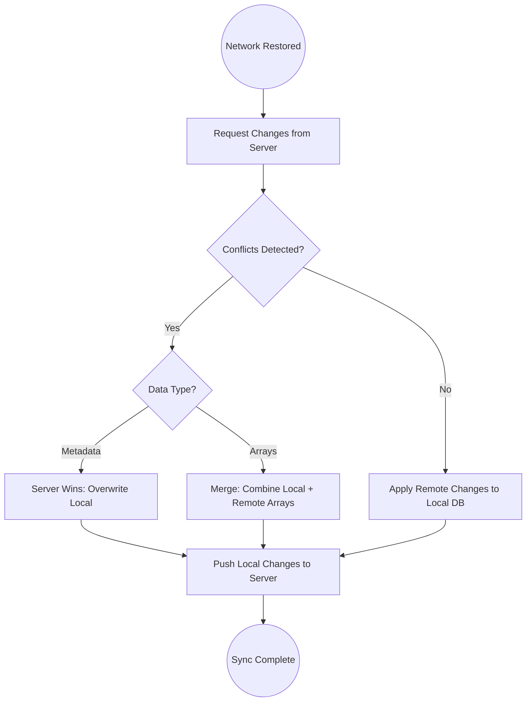

# Offline-First Sync Architecture

## The "Basement Problem"

Construction sites often lack cell service—basements, remote sites, underground areas. TradeFolio must ensure data integrity when a tradesperson finishes a job in a dead zone and syncs later.

## Sync Strategy Overview

WatermelonDB uses a **Pull-then-Push** synchronization strategy. This ensures the local client is aware of the current state of the "truth" (the server) before applying its own changes.



## Conflict Resolution Policies

### 1. The "Server Wins" Policy (Metadata)

Used for single-value fields like **Project Name**, **Location**, or **Status**.

**Scenario:**
A project owner updates a project title on the web dashboard while the apprentice updates it offline on the mobile app.

**Resolution:**
When the app syncs, it discards the local title change in favor of the server's version. This prevents "state drift" where the user sees one thing and the database sees another.

**Implementation:**

```typescript
// WatermelonDB sync adapter
const syncPullChanges = async (lastPulledAt: number) => {
  const response = await api.pullChanges(lastPulledAt);
  
  return {
    changes: response.changes,
    timestamp: response.timestamp,
  };
};

// For metadata fields, server version always takes precedence
const resolveMetadataConflict = (local: any, remote: any) => {
  // Server wins - return remote version
  return remote;
};
```

### 2. The "Merge" Policy (Arrays)

Used for **Skill Tags** and **Photo Galleries**.

**Scenario:**
Two users are working on the same "Whole House Rewire" project. User A adds 3 photos of the kitchen; User B (offline) adds 2 photos of the basement.

**Resolution:**
Instead of one set of photos overwriting the other, the sync engine performs a Set union. The resulting project contains all 5 photos.

**Technical Implementation:**

```typescript
// Merge policy for array fields
const mergeArrayConflict = (local: string[], remote: string[]) => {
  // Union of both arrays, preserving unique items
  const merged = [...new Set([...local, ...remote])];
  return merged;
};

// Handle deleted items
const mergeWithDeletions = (
  local: MediaItem[],
  remote: MediaItem[],
  localDeletions: string[],
  remoteDeletions: string[]
) => {
  // Combine deletions
  const allDeletions = new Set([...localDeletions, ...remoteDeletions]);
  
  // Merge arrays
  const merged = [...local, ...remote];
  
  // Remove deleted items
  return merged.filter(item => !allDeletions.has(item.id));
};
```

**Deletion Handling:**
WatermelonDB tracks "deleted" flags (`_status: 'deleted'`) so that if a user intentionally removes a photo while offline, it stays removed during the merge.

## Performance Optimization: The Sync Engine

To keep the app snappy, we use a **Changeset** approach rather than a full database dump.

### Timestamp Tracking

The app sends its `last_pulled_at` timestamp with every sync request.

```typescript
interface SyncRequest {
  lastPulledAt: number;  // Unix timestamp in milliseconds
  changes: {
    projects: ChangeSet<Project>;
    media: ChangeSet<Media>;
    skills: ChangeSet<ProjectSkill>;
  };
}

interface ChangeSet<T> {
  created: T[];
  updated: T[];
  deleted: string[];  // IDs only
}
```

### Delta Fetching

The backend only returns records created or modified *after* that timestamp.

```typescript
// Backend sync endpoint
async pullChanges(lastPulledAt: number): Promise<SyncResponse> {
  const timestamp = new Date(lastPulledAt);
  
  const [projects, media, skills] = await Promise.all([
    this.projectRepo.find({
      where: { updatedAt: MoreThan(timestamp) }
    }),
    this.mediaRepo.find({
      where: { updatedAt: MoreThan(timestamp) }
    }),
    this.skillRepo.find({
      where: { updatedAt: MoreThan(timestamp) }
    }),
  ]);
  
  return {
    changes: {
      projects: this.mapToChangeset(projects),
      media: this.mapToChangeset(media),
      skills: this.mapToChangeset(skills),
    },
    timestamp: Date.now(),
  };
}
```

### Local ID Mapping

Records created offline need ID mapping to associate with server-side counterparts.

```typescript
interface LocalRemoteIdMap {
  [localId: string]: string;  // localId -> serverId
}

// When pushing offline-created records
const pushCreatedRecords = async (localRecords: any[]) => {
  const response = await api.createBatch(localRecords);
  
  // Map local IDs to server IDs
  const idMap: LocalRemoteIdMap = {};
  response.created.forEach((record, index) => {
    idMap[localRecords[index]._id] = record.id;
  });
  
  // Update local records with server IDs
  await database.write(async () => {
    for (const local of localRecords) {
      await local.update(r => {
        r.serverId = idMap[local._id];
        r._status = 'synced';
      });
    }
  });
};
```

## Background Sync Implementation

### Sync Queue Architecture

```typescript
interface SyncJob {
  id: string;
  type: 'upload' | 'sync';
  payload: any;
  retryCount: number;
  maxRetries: number;
  createdAt: number;
  lastAttemptAt?: number;
  status: 'pending' | 'processing' | 'failed' | 'complete';
}

class SyncQueue {
  private jobs: SyncJob[] = [];
  
  async enqueue(job: Omit<SyncJob, 'id' | 'retryCount' | 'status'>) {
    const newJob: SyncJob = {
      ...job,
      id: generateId(),
      retryCount: 0,
      status: 'pending',
    };
    
    this.jobs.push(newJob);
    await this.persistQueue();
    this.processNext();
  }
  
  private async processNext() {
    const pending = this.jobs.find(j => j.status === 'pending');
    if (!pending) return;
    
    pending.status = 'processing';
    pending.lastAttemptAt = Date.now();
    
    try {
      await this.executeJob(pending);
      pending.status = 'complete';
    } catch (error) {
      pending.retryCount++;
      if (pending.retryCount >= pending.maxRetries) {
        pending.status = 'failed';
        this.notifyUser(pending, error);
      } else {
        pending.status = 'pending';
        // Exponential backoff
        await this.delay(Math.pow(2, pending.retryCount) * 1000);
      }
    }
    
    await this.persistQueue();
    this.processNext();
  }
}
```

### Network State Detection

```typescript
import NetInfo from '@react-native-community/netinfo';

class NetworkMonitor {
  private isConnected: boolean = false;
  private connectionType: string = 'unknown';
  
  init() {
    NetInfo.addEventListener(state => {
      const wasConnected = this.isConnected;
      this.isConnected = state.isConnected ?? false;
      this.connectionType = state.type;
      
      // Trigger sync when connection restored
      if (!wasConnected && this.isConnected) {
        SyncEngine.triggerSync();
      }
    });
  }
  
  shouldSync(): boolean {
    // Don't sync on cellular if user prefers WiFi-only
    if (this.connectionType === 'cellular' && userPrefs.wifiOnlySync) {
      return false;
    }
    return this.isConnected;
  }
}
```

## Binary Asset Handling

### The Problem

Storing binary assets (images) directly in WatermelonDB leads to:
- Severe performance degradation
- Sync instability
- Increased risk of data corruption

### The Solution: Reference-Pointer Architecture

Store only references (URLs, file paths) in the database. Keep actual binary assets in the device filesystem or cloud storage.

```typescript
// WatermelonDB schema for media
const projectMediaSchema = tableSchema({
  name: 'project_media',
  columns: [
    { name: 'project_id', type: 'string', isIndexed: true },
    { name: 'remote_url', type: 'string' },
    { name: 'local_path', type: 'string', isOptional: true },
    { name: 'blur_hash', type: 'string' },
    { name: 'sync_status', type: 'string' },  // pending, synced, error
    { name: 'file_size', type: 'number', isOptional: true },
    { name: 'created_at', type: 'number' },
    { name: 'updated_at', type: 'number' },
  ],
});
```

### Asset Download Manager

```typescript
import * as FileSystem from 'expo-file-system';

class AssetManager {
  private downloadQueue: string[] = [];
  
  async ensureLocalAsset(media: ProjectMedia): Promise<string> {
    // Return local path if already downloaded
    if (media.localPath && await this.fileExists(media.localPath)) {
      return media.localPath;
    }
    
    // Download in background
    const localPath = await this.downloadAsset(media.remoteUrl);
    
    // Update database with local path
    await database.write(async () => {
      await media.update(m => {
        m.localPath = localPath;
      });
    });
    
    return localPath;
  }
  
  private async downloadAsset(url: string): Promise<string> {
    const filename = url.split('/').pop();
    const localPath = `${FileSystem.documentDirectory}media/${filename}`;
    
    await FileSystem.downloadAsync(url, localPath);
    return localPath;
  }
  
  async getDisplayUri(media: ProjectMedia): Promise<string> {
    // Priority: local path > remote URL > blur hash placeholder
    if (media.localPath && await this.fileExists(media.localPath)) {
      return media.localPath;
    }
    
    if (await NetworkMonitor.isConnected()) {
      return media.remoteUrl;
    }
    
    // Return blur hash for placeholder
    return `blurhash://${media.blurHash}`;
  }
}
```

## Upload Queue

```typescript
class UploadQueue {
  async queueUpload(localPath: string, projectId: string) {
    // Create media record with pending status
    const media = await database.write(async () => {
      return database.get<ProjectMedia>('project_media').create(m => {
        m.projectId = projectId;
        m.localPath = localPath;
        m.syncStatus = 'pending';
        m.createdAt = Date.now();
      });
    });
    
    // Add to upload queue
    SyncQueue.enqueue({
      type: 'upload',
      payload: { mediaId: media.id, localPath },
      maxRetries: 5,
      createdAt: Date.now(),
    });
  }
  
  async executeUpload(job: SyncJob) {
    const { mediaId, localPath } = job.payload;
    
    // Get presigned URL
    // Use platform-agnostic path parsing (handles both / and \ separators)
    const fileName = localPath.split(/[/\\]/).pop();
    const { uploadUrl } = await api.requestUploadUrl({
      fileName,
      contentType: this.getMimeType(localPath),
    });
    
    // Upload file
    await FileSystem.uploadAsync(uploadUrl, localPath, {
      httpMethod: 'PUT',
      uploadType: FileSystem.FileSystemUploadType.BINARY_CONTENT,
    });
    
    // Update media record
    await database.write(async () => {
      const media = await database.get<ProjectMedia>('project_media').find(mediaId);
      await media.update(m => {
        m.syncStatus = 'synced';
        m.remoteUrl = this.getPublicUrl(uploadUrl);
      });
    });
  }
}
```

## Conflict Notification UI

```typescript
interface ConflictNotification {
  type: 'metadata_overwritten' | 'merge_required' | 'upload_failed';
  message: string;
  projectId: string;
  action?: () => void;
}

class ConflictHandler {
  async handleConflict(conflict: any): Promise<void> {
    const notification: ConflictNotification = {
      type: conflict.type,
      message: this.formatConflictMessage(conflict),
      projectId: conflict.projectId,
    };
    
    // Show in-app notification
    NotificationService.show(notification);
    
    // Log for debugging
    Analytics.track('sync_conflict', {
      type: conflict.type,
      resolution: conflict.resolution,
    });
  }
  
  private formatConflictMessage(conflict: any): string {
    switch (conflict.type) {
      case 'metadata_overwritten':
        return `Project "${conflict.projectTitle}" was updated elsewhere. Your local changes have been replaced.`;
      case 'merge_required':
        return `New photos were added to "${conflict.projectTitle}" from another device.`;
      default:
        return 'A sync conflict occurred.';
    }
  }
}
```

## Sync Status Indicators

```typescript
// React component for sync status
const SyncStatusIndicator: React.FC = () => {
  const [status, setStatus] = useState<'synced' | 'syncing' | 'pending' | 'offline'>('synced');
  const [pendingCount, setPendingCount] = useState(0);
  
  useEffect(() => {
    const unsubscribe = SyncEngine.onStatusChange((newStatus, count) => {
      setStatus(newStatus);
      setPendingCount(count);
    });
    return unsubscribe;
  }, []);
  
  return (
    <View style={styles.indicator}>
      {status === 'syncing' && <ActivityIndicator size="small" />}
      {status === 'pending' && (
        <Text>{pendingCount} changes pending</Text>
      )}
      {status === 'offline' && (
        <Icon name="cloud-offline" />
      )}
      {status === 'synced' && (
        <Icon name="cloud-done" color="green" />
      )}
    </View>
  );
};
```

---

*See [Architecture Overview](./architecture-overview.md) for full system context.*
