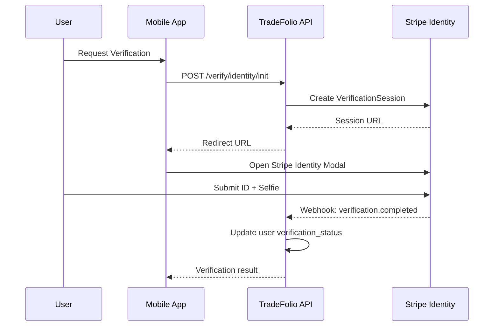

# Security, Privacy, and Compliance

Given that TradeFolio involves financial transactions and in-person interactions, security cannot be an afterthought.

## 1. Identity Verification (KYC/AML)

### Requirements

To comply with "Know Your Customer" (KYC) and Anti-Money Laundering (AML) regulations (required by the Patriot Act for financial platforms):

- Verify identity before payouts
- Prevent bot accounts
- Ensure safety for homeowners inviting workers into homes

### Implementation: Stripe Identity

**Why Stripe Identity:**
- Handles complex verification UI
- Scans government IDs
- Performs liveness checks
- Manages PII securely
- Generates compliance documentation

**Integration Flow:**



**Trigger Points:**
- KYC is mandatory before user can:
  - Receive a payout
  - Receive the "Verified Pro" badge
  - Post to the job board

### Data Minimization

**Critical Rule:** Do NOT store raw images of driver's licenses or SSNs in the application database.

```typescript
// User schema - only store verification metadata
interface UserVerification {
  stripeIdentityId: string;        // Reference to Stripe
  verificationStatus: 'pending' | 'verified' | 'failed';
  verifiedAt: Date | null;
  failureReason: string | null;    // Generic reason, not PII
}

// NEVER store:
// - ID images
// - SSN/EIN
// - Full address from ID
// - Date of birth
```

**PII Storage:** Delegate all PII storage to Stripe's secure vault. The app only stores:
- `verification_id` (Stripe's ID)
- `status` (verified, pending, failed)
- `verified_at` timestamp

### Granular Error Handling

Map Stripe Identity error codes to user-friendly messages:

| Stripe Code | User Message | Action |
|------------|--------------|--------|
| `document_expired` | "Your ID appears to be expired. Please use a valid ID." | Retry |
| `document_unverified_other` | "We couldn't verify your document. Please try again with better lighting." | Retry |
| `selfie_document_missing_photo` | "Please ensure your face is visible in the selfie." | Retry |
| `consent_declined` | "Verification requires your consent to proceed." | Explain & Retry |

## 2. Data Encryption

### Encryption at Rest

All data storage must be encrypted using AES-256:

```bash
# AWS RDS Configuration
aws rds modify-db-instance \
  --db-instance-identifier tradefolio-prod \
  --storage-encrypted \
  --kms-key-id alias/tradefolio-rds-key
```

```json
// S3 Bucket Encryption Policy
{
  "Rules": [{
    "ApplyServerSideEncryptionByDefault": {
      "SSEAlgorithm": "aws:kms",
      "KMSMasterKeyID": "alias/tradefolio-s3-key"
    }
  }]
}
```

**Encrypted Resources:**
- AWS RDS volumes (PostgreSQL)
- S3 buckets (media storage)
- ElastiCache (Redis) at-rest encryption
- EBS volumes (if any)

### Encryption in Transit

**Requirements:**
- TLS 1.2+ for all API connections
- TLS 1.3 preferred where supported
- Strong cipher suites only

```typescript
// NestJS HTTPS Configuration
const httpsOptions = {
  key: fs.readFileSync('private-key.pem'),
  cert: fs.readFileSync('certificate.pem'),
  minVersion: 'TLSv1.2',
  cipherSuites: [
    'TLS_AES_256_GCM_SHA384',
    'TLS_CHACHA20_POLY1305_SHA256',
    'TLS_AES_128_GCM_SHA256',
  ],
};
```

### Certificate Transparency (Modern Approach)

**Note:** Traditional certificate pinning is now discouraged due to:
- Maintenance burden during certificate rotation
- Risk of app breakage
- Adoption of Certificate Transparency

**Recommended Approach:**
1. Remove certificate pinning from mobile apps
2. Monitor Certificate Transparency logs for unauthorized certificates
3. Use tools like CertSpotter or Google CT logs

```typescript
// Instead of pinning, monitor CT logs
// Set up alerts for new certificates for your domains
const ctMonitorConfig = {
  domains: ['api.tradefolio.com', 'tradefolio.com'],
  alertEmail: 'security@tradefolio.com',
  webhookUrl: 'https://alerts.tradefolio.com/ct-event',
};
```

## 3. S3 Upload Security

### Pre-signed URLs

All client uploads MUST use time-limited, permission-scoped pre-signed URLs.

```typescript
// Backend: Generate presigned URL
async getUploadUrl(userId: string, fileName: string, contentType: string) {
  const key = `uploads/${userId}/${Date.now()}-${fileName}`;
  
  const command = new PutObjectCommand({
    Bucket: process.env.S3_BUCKET,
    Key: key,
    ContentType: contentType,
    // Prevent public access
    ACL: 'private',
    // Add metadata for tracking
    Metadata: {
      'uploaded-by': userId,
      'upload-time': new Date().toISOString(),
    },
  });
  
  const url = await getSignedUrl(s3Client, command, {
    expiresIn: 300,  // 5 minutes only
  });
  
  return { url, key };
}
```

### S3 Bucket Policies

```json
{
  "Version": "2012-10-17",
  "Statement": [
    {
      "Sid": "DenyNonPresignedUploads",
      "Effect": "Deny",
      "Principal": "*",
      "Action": "s3:PutObject",
      "Resource": "arn:aws:s3:::tradefolio-media/*",
      "Condition": {
        "StringNotEquals": {
          "s3:authType": "REST-QUERY-STRING"
        }
      }
    },
    {
      "Sid": "EnforceHTTPS",
      "Effect": "Deny",
      "Principal": "*",
      "Action": "s3:*",
      "Resource": "arn:aws:s3:::tradefolio-media/*",
      "Condition": {
        "Bool": {
          "aws:SecureTransport": "false"
        }
      }
    }
  ]
}
```

## 4. Review Integrity System

### Preventing Fake Reviews

To prevent the "fake review" plague common on other platforms:

#### Closed Loop Reviews
A client can only review a contractor if a transaction has occurred through the platform.

```typescript
async canLeaveReview(clientId: string, contractorId: string): Promise<boolean> {
  const transaction = await this.transactionRepo.findOne({
    where: {
      clientProfileId: clientId,
      contractorProfileId: contractorId,
      status: 'completed',
    },
  });
  
  return transaction !== null;
}
```

#### Peer Vouching Validation
A peer endorsement is only valid if the system detects:
- Overlap in employment history, OR
- Project co-location (based on GPS metadata of uploads)

```typescript
async validateVouch(fromUserId: string, toUserId: string, projectId: string): Promise<boolean> {
  // Check if BOTH users collaborated on the same project
  const [fromUserCollab, toUserCollab] = await Promise.all([
    this.collaboratorRepo.findOne({
      where: { projectId, profileId: fromUserId },
    }),
    this.collaboratorRepo.findOne({
      where: { projectId, profileId: toUserId },
    }),
  ]);
  
  // Both users must be collaborators on the project
  if (fromUserCollab && toUserCollab) return true;
  
  // Check GPS proximity of uploads (within 100m, same day)
  const proximityCheck = await this.checkGpsProximity(fromUserId, toUserId);
  
  return proximityCheck;
}
```

### Automated Content Moderation

Use AWS Rekognition to scan uploaded images before publication:

```typescript
async moderateImage(s3Key: string): Promise<ModerationResult> {
  const response = await rekognition.detectModerationLabels({
    Image: {
      S3Object: {
        Bucket: process.env.S3_BUCKET,
        Name: s3Key,
      },
    },
    MinConfidence: 75,
  }).promise();
  
  const blocked = response.ModerationLabels?.some(
    label => ['Explicit Nudity', 'Violence', 'Hate Symbols'].includes(label.Name)
  );
  
  return {
    approved: !blocked,
    labels: response.ModerationLabels,
    reviewRequired: response.ModerationLabels?.length > 0,
  };
}
```

## 5. GDPR/CCPA Compliance

Even if the startup is US-based, data privacy laws apply:
- CCPA (California Consumer Privacy Act)
- GDPR (if serving EU users)
- Various state privacy laws

### Required Features

#### "Download My Data"

```typescript
async exportUserData(userId: string): Promise<DataExport> {
  const [profile, projects, media, transactions, credentials] = await Promise.all([
    this.profileRepo.findOne({ where: { userId } }),
    this.projectRepo.find({ where: { profileId: userId } }),
    this.mediaRepo.find({ where: { /* user's media */ } }),
    this.transactionRepo.find({ where: { contractorProfileId: userId } }),
    this.credentialRepo.find({ where: { profileId: userId } }),
  ]);
  
  // Generate ZIP with all user data
  const archive = archiver('zip');
  archive.append(JSON.stringify(profile, null, 2), { name: 'profile.json' });
  archive.append(JSON.stringify(projects, null, 2), { name: 'projects.json' });
  // ... add all data
  
  // Upload to S3 with 24-hour expiry
  const downloadUrl = await this.uploadExport(archive, userId);
  
  // Notify user
  await this.emailService.sendDataExportReady(profile.email, downloadUrl);
  
  return { downloadUrl, expiresAt: new Date(Date.now() + 24 * 60 * 60 * 1000) };
}
```

#### "Delete My Account"

Must programmatically scrub user data from all tables and storage:

```typescript
async deleteAccount(userId: string): Promise<void> {
  // 1. Fetch user record to get email for suppression list
  const user = await this.userRepo.findOneOrFail({ where: { id: userId } });
  
  // 2. Add to suppression list (prevents restoration)
  await this.suppressionRepo.insert({ 
    email: user.email, 
    deletedAt: new Date() 
  });
  
  // 2. Delete from primary database
  await this.database.transaction(async (manager) => {
    await manager.delete('vouches', { fromProfileId: userId });
    await manager.delete('vouches', { toProfileId: userId });
    await manager.delete('project_media', { /* user's projects */ });
    await manager.delete('projects', { profileId: userId });
    await manager.delete('credentials', { profileId: userId });
    await manager.delete('transactions', { contractorProfileId: userId });
    await manager.delete('profiles', { userId });
  });
  
  // 3. Delete from S3
  await this.deleteUserMediaFromS3(userId);
  
  // 4. Delete from search index
  await this.searchService.deleteUser(userId);
  
  // 5. Notify Stripe to delete customer
  if (user.stripeCustomerId) {
    await stripe.customers.del(user.stripeCustomerId);
  }
  
  // 6. Log for compliance audit
  await this.auditLog.record('account_deleted', { userId, deletedAt: new Date() });
}
```

### Suppression List

Prevent restoration of deleted user data from backups:

```typescript
// Before restoring any data, check suppression list
async canRestoreUser(email: string): Promise<boolean> {
  const suppressed = await this.suppressionRepo.findOne({ 
    where: { email } 
  });
  
  return !suppressed;
}
```

## 6. Geospatial Privacy

### Location Fuzzing

Storing exact GPS coordinates without privacy protection increases user risk.

**Solution:** Store both exact and fuzzed locations, restricting access to exact data.

```typescript
// On data ingest, generate fuzzed location
function fuzzLocation(exact: Coordinates, privacyLevel: 'city' | 'state'): Coordinates {
  if (privacyLevel === 'state') {
    // Return state centroid
    return getStateCentroid(exact);
  }
  
  // Add random offset within ~1-2 miles
  const offsetLat = (Math.random() - 0.5) * 0.03;  // ~1 mile
  const offsetLng = (Math.random() - 0.5) * 0.03;
  
  return {
    latitude: exact.latitude + offsetLat,
    longitude: exact.longitude + offsetLng,
  };
}

// Database storage
interface ProjectLocation {
  exactCoords: Coordinates;     // Restricted access
  fuzzedCoords: Coordinates;    // Public search
  city: string;
  state: string;
  privacyLevel: 'exact' | 'city' | 'state';
}
```

### Access Control

```typescript
// Only privileged services can access exact location
@Guard(RoleGuard)
@Roles('admin', 'internal_service')
async getExactLocation(projectId: string): Promise<Coordinates> {
  const project = await this.projectRepo.findOne(projectId);
  
  // Log access for audit
  await this.auditLog.record('exact_location_accessed', {
    projectId,
    accessedBy: this.currentUser.id,
    accessedAt: new Date(),
  });
  
  return project.exactCoords;
}
```

## 7. API Security

### Rate Limiting

```typescript
// NestJS rate limiting configuration
@Module({
  imports: [
    ThrottlerModule.forRoot({
      ttl: 60,        // Time window in seconds
      limit: 100,     // Max requests per window
    }),
  ],
})
export class AppModule {}

// Stricter limits for sensitive endpoints
@Throttle(5, 60)  // 5 requests per minute
@Post('verify/identity')
async initiateVerification() { ... }
```

### Input Validation

```typescript
// Use class-validator for all inputs
class CreateProjectDto {
  @IsString()
  @MaxLength(100)
  title: string;
  
  @IsOptional()
  @IsString()
  @MaxLength(5000)
  description?: string;
  
  @IsOptional()
  @IsArray()
  @ArrayMaxSize(20)
  @IsUUID('4', { each: true })
  skillIds?: string[];
}
```

### SQL Injection Prevention

Always use parameterized queries:

```typescript
// GOOD: Parameterized query
const user = await this.userRepo.findOne({ 
  where: { email: userInput } 
});

// BAD: String concatenation (NEVER do this)
// const user = await manager.query(
//   `SELECT * FROM users WHERE email = '${userInput}'`
// );
```

## 8. Audit Logging

Maintain comprehensive audit logs for compliance:

```typescript
interface AuditLogEntry {
  id: string;
  timestamp: Date;
  action: string;
  userId: string | null;
  resourceType: string;
  resourceId: string;
  ipAddress: string;
  userAgent: string;
  metadata: Record<string, any>;
}

// Log all sensitive operations
await auditLog.record('profile_updated', {
  userId,
  changes: { field: 'email', old: '***', new: '***' },
});

await auditLog.record('payout_initiated', {
  userId,
  amount: 1000,
  destination: 'bank_***1234',
});
```

---

*See [Architecture Overview](./architecture-overview.md) for full system context.*
